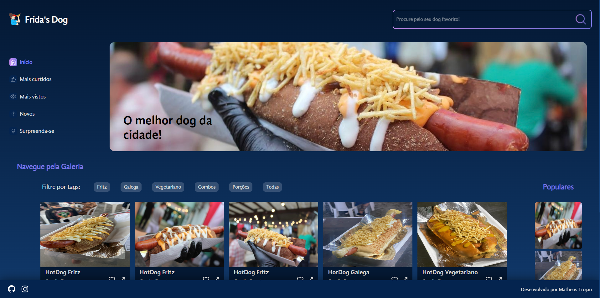
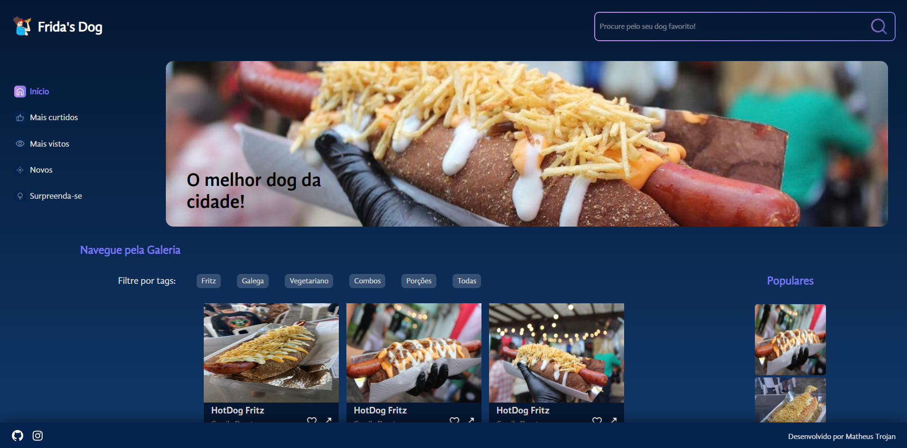

# Site da Marca Frida's Dog

Uma página criada com o intuito de aprendizado em React, com a temática de uma empresa de uma conhecida minha

## Conteúdo deste Readme:

- [Resumo](#resumo)
  - [O Desafio](#o-desafio)
  - [Screenshot](#screenshot)
  - [Deploy](#deploy)
- [Meu processo](#meu-processo)
  - [Projetado com](#projetado-com)
  - [O que eu aprendi](#o-que-eu-aprendi)
- [Autores](#autores)

## Resumo

### O Desafio

A página tem como objetivo exibir os produtos ofertados pela empresa, onde o usuário deve conseguir filtrar os itens conforme sua preferência. Criado como forma de praticar a utilização do React, foi construído durante as aulas do curso de React da Alura. 

O usuário deverá conseguir:

- Visualizar todos cards com os produtos vendidos pela empresa;
- Filtrar os produtos através das tags

### Screenshot

Imagem das imagens filtradas pela tag Fritz

### Deploy

Acesse através deste [link](https://fridas-dog.vercel.app/)

## Processo de Criação

### Projetado com

- React
- Componentes Reutilizáveis
- Responsividade para todas telas

### O que eu aprendi

🟢 Como iniciar um projeto com React 
🟢 Separação das pastas dos componentes para facilitar a manutenção 
🟢 Filtragem das imagens através de tags 
🟢 Importação dinâmica de imagens, fontes e estilos 

## Autor

- [Matheus Trojan](https://www.linkedin.com/in/matheus-trojan/)
